```mermaid
graph LR
  subgraph Device["ESP32‑S3 Controller"]
    S1["Hall Sensor (Speed/Distance)"]
    S2["Foot‑Lift TOF (UART/I2C)"]
    S3["HX711 Hand Pressure (optional)"]
    SD["SD_MMC CSV Logger"]
  end

  subgraph Backend["Azure Node.js Backend"]
    API1["GET /api/device/command"]
    API2["POST /api/device/:patientId/data"]
    DB["Azure SQL Database"]
  end

  subgraph Frontend["React Web App"]
    UI1["Therapist Dashboard"]
    UI2["Charts & Reports"]
    UI3["Start/Stop Controls"]
  end

  %% Data flow
  S1 --> SD
  S2 --> SD
  S3 --> SD

  Device -->|HTTPS GET command| API1
  Device -->|HTTPS POST measurements JSON| API2
  API2 --> DB

  Frontend -->|REST API| Backend
  Frontend --> UI1
  UI1 --> UI2
  UI1 --> UI3
```

# Mobile Gait Lab (ESP32‑S3)

> **Important**: This repository targets an **ESP32‑S3 controller _without_ a camera**.  
> Video capture and Azure Blob Storage are **not** used in this build.  
> Data is sampled from sensors, logged to **SD_MMC** as CSV during the run, and then **uploaded as JSON** to the backend after the run ends.

---

## 📌 Overview

Mobile Gait Lab is a **portable gait‑assessment stack** consisting of:

- **ESP32‑S3 firmware (Arduino)**: reads *speed*, *foot‑lift*, and optional *hand‑pressure* signals; logs to **SD_MMC**; uploads summarized time‑series JSON to server.
- **Cloud backend (Node.js/Express + Azure SQL)**: receives device data at `/api/device/{patientId}/data`, persists measurements, powers therapist UI and AI recommendations.
- **React Frontend** (not in this ZIP): therapist dashboard, charts, session control (start/stop).

This README is based on the actual sources in the ZIP and aligned to a **no‑camera** controller.

---

## 🧩 Project Structure (firmware)

```
MobileGaitLab/
├─ MobileGaitLab.ino          # Main sketch: Wi‑Fi, SD_MMC, run loop, command polling, upload
├─ Config.h                    # Pins, sampling frequency, feature flags
├─ Measurement.h               # Unified measurement struct
├─ SpeedSensor.{h,cpp}         # Hall-effect speed sensing
├─ FootLiftSensor.{h,cpp}      # Foot lift sensing (UART TOF or I2C)
├─ HandPressureSensor.{h,cpp}  # Optional HX711‑based hand pressure
├─ SensorManager.{h,cpp}       # Owns sensors; update/reset; snapshot → Measurement
├─ SpeedAnalyzer.{h,cpp}       # Aggregations post-run (avg speed, distance,...)
├─ FootLiftAnalyzer.{h,cpp}    # Aggregations for foot lifts
├─ HandPressureAnalyzer.{h,cpp}# Aggregations for hand pressure
├─ DualLogger.{h,cpp}          # CSV logging to SD_MMC (during run)
├─ SpeedLogger.{h,cpp}         # Per-sensor log helpers
├─ FootLiftLogger.{h,cpp}
├─ HandPressureLogger.{h,cpp}
├─ CommandClient.{h,cpp}       # GET /api/device/command → {command, patientId}
├─ DataUploader.{h,cpp}        # POST JSON array → /api/device/{patientId}/data
└─ CsvLoad.h                   # CSV helpers (if needed)
```

---
## 🔄 Typical Workflow

---
## ⚙️ Build & Dependencies (Arduino)

- **Board**: *ESP32S3* (e.g., *Seeed XIAO ESP32‑S3* or similar **without** camera).
- **Arduino Core**: esp32 >= 2.0.x
- **Libraries**:
  - `WiFi.h`, `WiFiClientSecure.h`, `HTTPClient.h`
  - `ArduinoJson` (6.x)
  - `FS.h`, `SD_MMC.h`, `LittleFS.h`
  - (Optional) `HX711` — hand pressure via load cells (only if `ENABLE_HX711 == 1`)
  - (Optional) `VL53L1X` — **only** if using I2C TOF mode instead of UART

### Key Pins & Rates (from `Config.h`)

```cpp
// Sampling
static constexpr uint32_t SAMPLE_HZ = 50;        // 50 Hz
static constexpr uint32_t SAMPLE_MS = 1000 / SAMPLE_HZ;

// CSV file on SD
static constexpr char  LOG_PATH[] = "/run.csv";

// Hall-effect speed sensor
static constexpr int   SPEED_PIN       = 4;
static constexpr float WHEEL_DIAM_M    = 0.116f;
static constexpr float WHEEL_CIRCUM_M  = 3.1415926f * WHEEL_DIAM_M;
static constexpr int   MAGNETS_PER_REV = 1;
static constexpr float DIST_PER_PULSE_M= WHEEL_CIRCUM_M / MAGNETS_PER_REV;

// Foot-lift sensors — using **UART** by default
#define FOOTLIFT_CONN_UART 1
static constexpr uint8_t FOOT_LEFT_RX   = 15; // white
static constexpr uint8_t FOOT_LEFT_TX   = 16; // green
static constexpr uint8_t FOOT_RIGHT_RX  = 17;
static constexpr uint8_t FOOT_RIGHT_TX  = 18;

// If you switch to I2C mode (unset UART):
// static constexpr uint8_t TOF_SDA = 21;
// static constexpr uint8_t TOF_SCL = 22;
// static constexpr uint8_t FOOT_LEFT_XSHUT  = 32;
// static constexpr uint8_t FOOT_RIGHT_XSHUT = 33;

// Optional HX711 (disabled by default)
#define ENABLE_HX711 0
static constexpr uint8_t HANDL_DOUT = 32;
static constexpr uint8_t HANDL_SCK  = 33;
static constexpr uint8_t HANDR_DOUT = 25;
static constexpr uint8_t HANDR_SCK  = 26;
```

### SD_MMC Pins (from `MobileGaitLab.ino`)

```cpp
#define SD_MMC_CMD 38
#define SD_MMC_CLK 39
#define SD_MMC_D0  40
SD_MMC.setPins(SD_MMC_CLK, SD_MMC_CMD, SD_MMC_D0);
SD_MMC.begin("/sdcard", true, true, SDMMC_FREQ_DEFAULT, 5);
```

> **Note**: The sketch **requires** a working SD‑MMC connection. The device logs samples to CSV during the run.

---

## 🔄 Typical Workflow (No‑Camera Controller)

1. **Power On & Wi‑Fi**
   - Device boots, initializes `SD_MMC`, sensors, and connects to Wi‑Fi (SSID/PASS defined in `MobileGaitLab.ino`).

2. **Command Polling**
   - Every `POLL_INTERVAL=3000ms`, firmware **GETs** `https://<server>/api/device/command` via `CommandClient`.
   - Expected response (any of the following shapes):
     ```json
     {"command":{"command":"start","patientId":"1"}}
     {"command":"start","patientId":"1"}
     {"command":{"command":"idle","patientId":null}}
     ```

3. **Start Run (`start`)**
   - Firmware calls `startRun()`:
     - Resets all sensors (`SensorManager.resetAll()`).
     - Opens a **new CSV** file on SD (e.g., `/run_<millis>.csv`).
     - Switches `DualLogger` to **ONLINE** (active logging).

4. **Sampling & Logging**
   - At **50 Hz** (`SAMPLE_HZ`) the loop:
     - `SensorManager.updateAll()` → reads speed, foot‑lifts, (optional) pressures.
     - Creates a `Measurement` snapshot and **appends** to CSV (`DualLogger.log(m)`).
     - Verbose prints (optional) show speed/distance/lifts/pressure in real time.

5. **Stop Run (`stop`)**
   - Closes current CSV and performs **on‑device analysis**:
     - Compute *duration*, *distance*, *avg speed*, *foot lifts (L/R)*, *avg hand pressures*.
   - **Upload phase**:
     - `DataUploader.upload(baseUrl, patientId, vector<Measurement>)` builds a **JSON array** and `POST`s to `/api/device/{patientId}/data`.

6. **Backend Processing**
   - Server persists JSON time‑series to DB.
   - Dashboard charts become available for the therapist (no video sync expected in this build).

---

## 🖥️ System Architecture 

```
[ Therapist UI (React) ]
      │  REST
      ▼
[ Node.js/Express Backend ]
  • /api/device/command        (GET)  ← ESP32-S3 polls
  • /api/device/{pid}/data     (POST) ← ESP32-S3 uploads JSON
  • Azure SQL (patients, sessions, metrics)

      ▲
      │ Wi‑Fi
      ▼
[ ESP32‑S3 Controller ]
  • Sensors: Hall speed, TOF foot‑lifts (UART/I2C), HX711 (optional)
  • SD_MMC CSV logging during run
  • JSON upload after run
```

---

---


---

## 🗂️ Data Contracts

### 1) **Command Poll** (device → server → device)

- **Request**: `GET /api/device/command`
- **Response** (any supported form; firmware normalizes them):
  ```json
  {"command":{"command":"start","patientId":"2"}}
  ```
  or
  ```json
  {"command":"stop","patientId":"2"}
  ```

Parsed fields in firmware (`CommandClient`):
```cpp
struct Command {
  String command;   // "start" | "stop" | "idle"
  String patientId; // e.g., "2"
  bool valid = false;
};
```

### 2) **Measurement Upload** (device → server)

- **Request**: `POST /api/device/{patientId}/data`
- **Body**: JSON **array** of time‑ordered `Measurement` objects:
  ```json
  [
    {
      "distance": 3.42,
      "speed": 0.65,
      "handPressureL": 0.0,
      "handPressureR": 0.0,
      "footLiftL": 1,
      "footLiftR": 0,
      "timestamp": 123456789
    }
  ]
  ```

- **Response**: `2xx` on success; body is logged for debugging.

**Measurement fields** (see `Measurement.h`):
- `distance` (meters, cumulative)
- `speed` (m/s, instantaneous)
- `handPressureL`, `handPressureR` (kg; optional, 0 if disabled)
- `footLiftL`, `footLiftR` (counters / discrete events)
- `timestamp` (ms from boot or monotonic time basis)

---

## 🔧 Key Firmware Components (Important Functions)

### `MobileGaitLab.ino`
- `setup()` — init SD_MMC, sensors, Wi‑Fi; start idle loop.
- `loop()` — poll commands; sample & log at 50 Hz while running.
- `startRun()` — reset sensors, open new CSV, enable logging.
- `stopRun()` — close CSV, compute summaries, **upload JSON** via `DataUploader`.

### `CommandClient`
```cpp
CommandClient::poll();  // GETs /api/device/command, parses {command, patientId}
```

### `DataUploader`
```cpp
bool upload(const String& baseUrl, const String& patientId, const std::vector<Measurement>& data);
// POSTs JSON array to {baseUrl}/{patientId}/data with TLS (setInsecure)
```

### `SensorManager`
```cpp
bool begin();     // initializes available sensors
void updateAll(); // reads all sensors (speed, foot L/R, pressure L/R)
Measurement readAll();
void resetAll();  // zero counters for a fresh run
```

### `SpeedSensor`
- `begin()` — attach ISR to `SPEED_PIN`, set PULLUP.
- `update()` — compute instantaneous speed and cumulative distance.
- `resetPublic()` — zero counters between runs.

### `FootLiftSensor`
- UART mode (`Serial1`, `Serial2`) **or** I2C mode. Toggle via `FOOTLIFT_CONN_UART`.
- Exposes displacement/threshold logic → discrete lift counts.

### `HandPressureSensor` (optional)
- Requires `ENABLE_HX711=1` + wiring and calibration factors.

### `DualLogger`
- Modes: `OFFLINE` (no logging) / `ONLINE` (CSV append).
- `open(path)`, `log(Measurement)`, `close()`.

### Analyzers
- `SpeedAnalyzer` / `FootLiftAnalyzer` / `HandPressureAnalyzer`: compute session aggregates used for therapist summary.

---

## 🧪 Testing & Debugging

- **Serial Logs** at 115200:
  - SD init success/failure
  - Command fetch trace (HTTP status + parsed command)
  - Upload begin/end, status, and truncated JSON preview
- **CSV Validation**:
  - Ensure `/sdcard` contains a newly created `/run_<millis>.csv` during each run.
- **Wi‑Fi**:
  - Ensure SSID/PASS in `MobileGaitLab.ino` match the hotspot/router in use.
- **Foot‑Lift UART Mode**:
  - Confirm the correct RX/TX pairs per sensor and matching baud rate (`115200`).

---

## 🔒 Security Notes

- TLS uses `WiFiClientSecure` with `client.setInsecure()` for simplicity.  
  For production, validate the server certificate (fingerprint/DER bundle).

---

## 🧭 Configuration Flags (quick reference)

- `FOOTLIFT_CONN_UART` = 1 → TOF via UART (`Serial1`/`Serial2`), else I2C
- `ENABLE_HX711` = 0/1 → enable/disable hand pressure
- `ONLINE_FOOTLIFT_COUNT` = 0 → set to `1` to count lifts during run
- `LOG_*` flags → control what is persisted in CSV

---

## 📡 Backend Endpoints (expected)

- `GET /api/device/command` → returns `{command, patientId}`
- `POST /api/device/{patientId}/data` → accepts JSON array of `Measurement`s

> This build **does not** rely on Blob Storage or any camera endpoints.

---

## 📜 License

MIT License © 2025 Mobile Walking Lab Team
Part of the **Mobile Walking Lab Project**.  
🔗 Server-side: [MobileWalkingLab_server](https://github.com/NoaGilboa/MobileWalkingLab_server)

---
